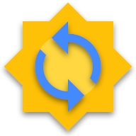

  
  <h1 align="center">EteSync - Secure Data Sync</h1>

Secure, end-to-end encrypted, and privacy respecting sync for your contacts, calendars and tasks (iOS client).

# Overview

Please see the [EteSync website](https://www.etesync.com) for more information.

EteSync is licensed under the [GPLv3 License](LICENSE).

# App is currently in beta

The app is still missing a few features to be ready for release. Here's a short list of things that are less than optimal but will improve as we go along:

1. Setup is a bit clunky and requires manually adding an account to the device.
2. Some operations are a bit slow so initial sync can even take a few minutes. Just wait. Don't interrupt it.
3. Address books are not currently synced to the device, you can only view the change log. This is due to [an expo bug](https://github.com/expo/expo/pull/6016) that we already fixed upstream, but are waiting for a release that includes it.
4. Sync is only triggered when you open the app and when you manually click the sync button. It doesn't yet sync automatically in the background.
5. Recurring events and tasks are currently read-only and any changes to them won't sync back to other clients.

# Setup

The app is not yet on the app store so can't be installed directly, but we can use Expo Client to launch it and even sync!

Setup insturctions:
1. Install the [Expo Client](https://apps.apple.com/us/app/expo-client/id982107779) app on your iPhone.
2. Add CalDAV and CardDAV accounts to your iPhone as explained in the [section below](#adding-required-accounts).
3. Click on the link in [this page](https://stosb.com/~tom/expo.html) on your iPhone to launch the EteSync app in expo.

After doing the above you can now just launch the EteSync app directly from the Projects tab of the expo app. That's it!

Now you can just open the app and log in! The initial sync may take a bit of time, so please keep the app open until it's done.

**Note:** at this stage you may want to set EteSync as your default account. In order to do it, open the Settings app, scroll down to Calendars (or Reminders) and set one of the EteSync calendars as the default.

## Adding required accounts

Since iOS doesn't support creating accounts programatically, we need to create the accounts EteSync will use ourselves.

You can either follow [this video](https://stosb.com/~tom/ios_add_accounts.mp4) or the textual step-by-step below. The account description must be exactly `etesync` otherwise sync won't work.

1. Open the Settings app
2. Scroll down and open "Passwords & Accounts"
3. Click "Add Account", then "Other" and then "Add CalDAV Account".
4. Enter the following into the form (this is a fake account so won't actually connect to anything):
  * Server: localhost
  * Username: aaaaa
  * Password: aaaaa
  * Description: etesync (needs to be exactly etesync!)
5. Click "Save".
6. You will now get a popup saying "Cannot Connect Using SSL", Click "Continue".
7. You'll now get a popup about account verification failing. Click "OK".
8. Click "Save" again until the account is saved.
9. Follow the same instructions for CardDAV.

# Thanks

EteSync iOS is made possible with financial support from <a
href="https://nlnet.nl/">NLnet Foundation</a>, courtesy of <a
href="https://nlnet.nl/discovery">NGI0 Discovery<a/> and the <a
href="https://ec.europa.eu">European Commission</a> <a
href="https://ec.europa.eu/info/departments/communications-networks-content-and-technology_en">DG
CNECT</a>'s <a href="https://ngi.eu">Next Generation Internet</a>
programme.

